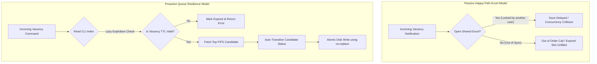

# 📋 **FilaVaga — Eliminating Vacancy Queue Management Friction & Placement Latency**

### **High-Performance In-Memory Local CLI Vacancy Matching Engine with Dynamic Temporal Logic**

[](https://www.python.org/)
[](<https://en.wikipedia.org/wiki/Hexagonal_architecture_(software)>)
[](https://docs.python.org/3/)
[](https://docs.pytest.org/)

---

## **🏛️ Repository Metadata & Context**

| Property               | Description                                                                                 |
| :--------------------- | :------------------------------------------------------------------------------------------ |
| **Role**               | Core Repository Architecture / Project Lead                                                 |
| **Target Segment**     | Public Employment Center Counselors (SINE - Sistema Nacional de Emprego)                    |
| **Architecture Style** | Hexagonal Architecture (Ports & Adapters)                                                   |
| **Execution Engine**   | In-Memory thread-safe queues (`collections.deque`) with atomic flat-file JSON serialization |
| **Date of Creation**   | June 15, 2026                                                                               |
| **Current Version**    | v1.1.0                                                                                      |

---

## **🚀 1. The Product Vision & Core Problem**

### **1.1. The Macro Pain Space**

Traditional public employment centers (such as SINE in Brazil) typically rely on centralized, high-latency legacy systems or informal local workarounds (like shared Excel sheets or paper registers) to manage candidate waitlists and job openings.

In these operational setups, counselors manually search through flat tables to match incoming vacancies with job-seekers. Because these lists lack temporal awareness, automatic sorting, and state synchronization:

1. **FIFO Priority is routinely violated**, skipping qualified candidates who registered early.
2. **Vacancies expire unfilled** because expiration windows (TTL) are not proactively tracked.
3. **Counselor efficiency drops by 40–60%** due to time wasted navigating spreadsheet conflicts and manual status lookups.
4. **Data corruption** occurs frequently from concurrent spreadsheet writes.

### **1.2. The Core Solution Paradigm Shift**

**FilaVaga** solves this operational bottleneck by introducing a lightweight, queue-native command-line application that runs locally on restricted SINE workstations. It transitions operations from a passive database-query model to a high-speed, structured FIFO queue matching flow.

- **Strategic Paradigm Shift:** FilaVaga replaces slow, error-prone manual Excel filters with an in-memory queue manager that instantly returns the highest-priority, eligible matching candidate for any given vacancy based on registration timestamps and CBO (Classificação Brasileira de Ocupações) codes.

---

#### **📌 Eventual Consistency Recovery Model**



To guarantee business integrity, FilaVaga implements the following operational SLA constraint: **Candidate matching queries for datasets containing up to 10,000 active candidates must render in less than 5 milliseconds on a basic dual-core workstation.**

---

## **🎮 2. CLI / Interface Usage Reference**

The command-line interface is optimized for high keyboard throughput. Use the following core execution commands:

| Command / Action                | Syntax                                                   | Description                                                                               | Example                                                               |
| :------------------------------ | :------------------------------------------------------- | :---------------------------------------------------------------------------------------- | :-------------------------------------------------------------------- |
| **Global Language Option**      | `--lang <lang>` or `-l <lang>`                           | Sets the active session language (supports: `pt`, `en`, `es`, `fr`, `de`).                | `filavaga --lang en dashboard`                                        |
| **Register Candidate**          | `register --name "<name>" --cbo "<cbo>" --zone "<zona>"` | Appends a new candidate to the tail of the matching FIFO sub-queue.                       | `filavaga register --name "Maria Silva" --cbo "4110-10" --zone "SUL"` |
| **Interactive Match**           | `match --id "<vacancy_id>"`                              | Validates vacancy TTL, pulls priority candidate, and starts interactive matching session. | `filavaga match --id "v_01h3nbfa4y1z8"`                               |
| **Interactive Dashboard**       | `dashboard`                                              | Launches the interactive TUI shell manager supporting single-character hotkey actions.   | `filavaga dashboard`                                                  |
| **Update Status Manually**      | `status-update --candidate "<id>" --to "<status>"`       | Transitions candidate state machine (`PENDING`, `CONTACTED`, `PLACED`, `REJECTED`).       | `filavaga status-update --candidate "c_01h3n" --to "PLACED"`          |
| **Purge PII (LGPD Compliance)** | `purge-all`                                              | Clears all personal identifiable information (PII) from local data directories.           | `filavaga purge-all`                                                  |

> [!TIP]
> **Dashboard Interactive Shortcuts:**
> * `[C]` / `[c]` — Interactively registers a new candidate.
> * `[M]` / `[m]` — Interactively matches a vacancy to the highest priority candidate.
> * `[L]` / `[l]` — Launches the dynamic language selection dialog (1: pt, 2: en, 3: es, 4: fr, 5: de).
> * `[Q]` / `[q]` — Exits the interactive TUI session.

> [!NOTE]
> **Data & Validation Rules:**
>
> - **CBO Codes:** Candidate and vacancy classifications must align with standard Brazilian CBO formats (e.g., `4110-10`).
> - **State Machines:** Candidate statuses can only transition along defined paths: `PENDING` ➔ `CONTACTED` ➔ `PLACED` or `REJECTED`. Direct transitions from `PENDING` to `PLACED` are prohibited.
> - **Write Atomicity:** Local data is saved by writing first to a `.tmp` file and then executing a platform-native rename to avoid state corruption during power failures.

---

## **🛠️ 3. Technical Stack Overview**

FilaVaga relies on a streamlined, zero-dependency local footprint to bypass administrative execution restrictions.

| Architectural Layer        | Component / Technology                                       | Technical Rationale                                                                      |
| :------------------------- | :----------------------------------------------------------- | :--------------------------------------------------------------------------------------- |
| **Client / Presenter**     | Python Native CLI (Argparse & Rich Output)                   | Ensures 100% compatibility with terminal screen readers (NVDA/JAWS) and legacy consoles. |
| **i18n Translation Engine**| Custom Translation Service (`translation.py` + JSON locales) | Resolves active language using strict precedence rules with directory traversal safety.   |
| **Execution Engine**       | Python 3.10+ Standard Library                                | Eliminates runtime compilation issues. Uses standard collections (`collections.deque`).  |
| **Memory Management**      | Reentrant Thread Locks (`threading.RLock`)                   | Prevents in-memory race conditions during concurrent CLI session exports.                |
| **Database & Ledger**      | In-Memory Index Hashmaps (`dict`)                            | Achieves sub-millisecond query lookups ($O(1)$) without DBMS server dependencies.        |
| **Persistence Drive**      | Atomic JSON Serializer (`state_snapshot.json`)               | Protects data state by using double-buffer writes (temp files + atomic renames).         |

---

## **🏗️ 4. Core Architectural Premises**

- **Premise 4.1 - Hexagonal Boundaries:** Business rules (`filavaga.core`) are completely isolated. They do not import from persistence, presentation layers, or OS-level standard modules.
- **Premise 4.2 - Test-Driven Development (TDD):** A strict Red-Green-Refactor development cycle is enforced. Invariants and state machine checks are fully tested.
- **Premise 4.3 - Privacy & Local Compliance:** In accordance with LGPD, no PII (Brazilian CPFs, exact addresses) is stored in the database snapshot files. Obfuscated UUID keys are used internally.
- **Premise 4.4 - Lazy Evaluation of Deadlines:** Rather than running background daemon processes that consume CPU cycles, vacancy deadlines (TTL) are validated lazily at query/evaluation time.

---

## **📂 5. Codebase Structure & Directory Standards**

```text
FilaVaga/
├── pyproject.toml              # Build specifications, dependencies & tool rules
├── config.json                 # JSON local workspace rules & business TTL limits
├── logs/                       # Local directory for logging exports
├── filavaga/                   # Core application root
│   ├── __init__.py
│   ├── main.py                 # CLI entry point bootstrap coordinator
│   │
│   ├── locales/                # JSON Translation locale resources
│   │   ├── pt.json
│   │   ├── en.json
│   │   ├── es.json
│   │   ├── fr.json
│   │   └── de.json
│   │
│   ├── core/                   # Domain Core Layer (Pure Logic)
│   │   ├── __init__.py
│   │   ├── entities.py         # Invariant Business Models (Candidate, Vacancy, Queue)
│   │   ├── value_objects.py    # Immutable Types (ProfessionCode, SectorZone, Timestamp)
│   │   └── exceptions.py       # Domain-specific validation exceptions
│   │
│   ├── application/            # Application Use Case Layer (Ports & Orchestrators)
│   │   ├── __init__.py
│   │   ├── ports/              # Port Abstractions (Boundary Interfaces)
│   │   │   ├── inbound.py      # Use case boundaries (IRegisterCandidate, IMatchVacancy)
│   │   │   └── outbound.py     # Port abstractions (IStateRepository, IClock)
│   │   └── services/           # Service Managers (QueueManager, MatchEngine)
│   │
│   ├── infra/                  # Infrastructure Adapter Layer (Concrete Drivers)
│   │   ├── __init__.py
│   │   ├── logger.py           # Structured JSON logging configurations
│   │   ├── translation.py      # i18n Translation Service engine
│   │   ├── cli/                # Terminal CLI UI Adapters (Argparse, Presenter)
│   │   │   ├── command_router.py
│   │   │   └── presenter.py
│   │   └── persistence/        # Storage Adapters
│   │       ├── atomic_json.py  # Atomic persistence engine
│   │       └── system_clock.py # Concrete timezone-safe clock adapter
│   │
└── tests/                      # Validation Suite
    ├── __init__.py
    ├── test_domain.py          # Domain invariant checks
    ├── test_usecases.py        # Mocked use case flow matching logic
    ├── test_infra.py           # Atomic I/O write recovery assertions
    ├── test_i18n.py            # Translation resolution logic validation
    ├── test_interactive.py     # Menu loop and hotkey validation
    └── test_presenter_i18n.py  # Localized console rendering validation
```

---

## **💻 6. Local Engineering Development Setup**

### **6.1. Core System Prerequisites**

- **Language Environment:** Python 3.10+ installed on the host system.
- **Package Manager:** `pip` and `virtualenv` recommended.
- **External Services:** None (100% offline-first application).

> [!NOTE]
> **ASCII Fallback Mode:**
> If you are running the application in a legacy terminal or using screen readers that do not support unicode box-drawing characters, set the environment variable `FILAVAGA_ASCII=1` to force the UI presenter to render clean ASCII-only tables and borders.

### **6.2. Initial Bootstrap Sequence**

1. Clone this repository to your local workstation:

   ```bash
   git clone https://github.com/KalyelNLaurindo/filavaga.git
   cd filavaga
   ```

2. Create and activate a local Python virtual environment:

   ```bash
   python -m venv .venv
   # On Windows:
   .venv\Scripts\activate
   # On Unix/macOS:
   source .venv/bin/activate
   ```

3. Install the application in development mode:
   ```bash
   pip install -e .
   ```

### **6.3. Automated Verification Commands**

Ensure your modifications pass the repository quality gates before submitting a Pull Request:

- **Execute primary system test engine (pytest)**:

  ```bash
  pytest tests/
  ```

- **Verify static type constraints**:

  ```bash
  mypy filavaga/
  ```

- **Run code quality linter checks**:
  ```bash
  flake8 filavaga/
  ```

## 7. 🚀 Planned Roadmap: HTTP REST API Backend

As detailed in task [TSK-34](context/backlog/TSK-34.md), we are planning to integrate a lightweight REST API server (using FastAPI) to expose the core matching engine and candidate queues over HTTP. This will allow FilaVaga to be run as an active backend service:
* `POST /candidates` - Register a candidate.
* `POST /vacancies` - Register a vacancy.
* `POST /queues/fill` - Attempt to match and place a candidate.
* `GET /queues/status` - Live status of all profession queues.

---


🏁 **End of Document:** This repository README serves as the definitive engineering portal for the **FilaVaga** ecosystem. Changes to stack versions, core patterns, or installation requirements must follow official pull-request governance.

Made with ❤️ by **Kalyel N. Laurindo / Software Engineer**
