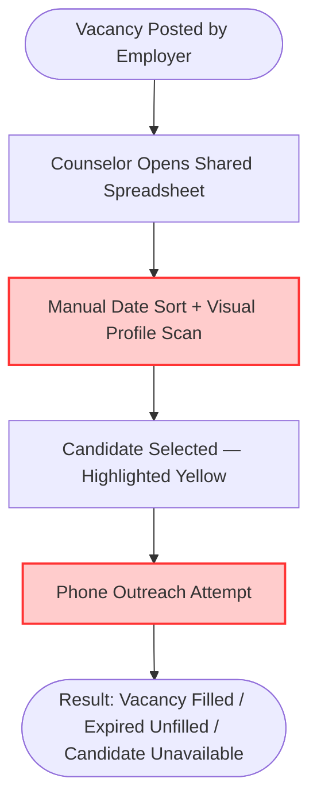

# **📋 Product Discovery Document: FilaVaga — Eliminating Vacancy Queue Management Friction**

**Role:** Product Owner / Product Manager

**Objective:** Investigate, map, and deeply understand the core pain points and the current "As-Is" operational friction around vacancy queue management before designing any technical solution.

**Context:** FilaVaga — A simulated problem discovery exercise for a portfolio project targeting public employment center counselors who manage job vacancy waitlists through manual, unstructured processes with no temporal awareness or automated queue ordering.

---

## **🏛️ Project Metadata**

- **Client / Segment:** Public Employment Center (SINE — Sistema Nacional de Emprego) — Internal Operations Tooling
- **Date of Creation:** June 13, 2026
- **Lead Product Owner:** Kalyel N. Laurindo / Project Owner
- **Document Version:** v1.0
- **Discovery Input Source:** Simulated domain research — best-practice synthesis based on SINE operational reports, Brazilian labor market tooling patterns, and portfolio project scope definition

---

## **1. 🎯 The Core Problem (Macro Pain Point)**

### **💡 Understanding the Macro Pain**

The Macro Pain is the **root operational dysfunction or friction** affecting the client or the business. It is never "the lack of a feature" — it is the tangible negative impact generated by the current process.

### **✍️ Step-by-Step Problem Formulation**

- **Field 1.1 - Affected Persona(s):** Employment Counselors (Orientadores de Emprego) at public SINE branches — the staff responsible for matching registered job-seekers to available employer vacancies.

- **Field 1.2 - Operational Bottleneck:** Counselors manually search through paper registration sheets and Excel spreadsheets to identify the next eligible candidate in the waitlist for each vacancy, then cross-check registration date, profile match, and whether the vacancy slot is still open — all without any automated ordering, expiration alerts, or filter capability.

- **Field 1.3 - Frequency & Context:** Every time a company vacancy is posted or updated at the branch (multiple times daily during peak hiring seasons), counselors must restart a full manual search across the entire candidate waitlist.

- **Field 1.3.1 - Trigger Frequency:** **Transactional** (triggered each time a vacancy opens or a candidate's status changes)

- **Field 1.3.2 - Operational Impact Velocity:** **Immediate Blocker** — counselors cannot refer candidates until the manual search resolves, directly delaying placement.

- **Field 1.4 - Direct Negative Impact:** Qualified candidates are skipped out of order because the manual list is unsorted; vacancies expire unfilled because no alert system exists; counselors spend 40–60% of their shift on list navigation instead of candidate guidance; candidates who already accepted other offers remain in the active queue, causing wasted outreach cycles.

- **Field 1.5 - Consolidated Macro Pain Statement:**
  > _Employment Counselors at SINE branches spend the majority of their operational shift manually navigating unordered paper and spreadsheet waitlists for every incoming vacancy, which causes qualified candidates to be skipped out of priority sequence, vacancies to expire unfilled, and placement throughput to drop by an estimated 35–50% below achievable capacity._

---

### **❓ Situational Diagnostic Verification**

- **Diagnostic Q1:** Who is directly affected by this pain, and where exactly does it occur in the active workflow?
  - _Answer:_ Employment Counselors are directly affected at the moment of candidate-to-vacancy matching. The pain peaks whenever a new batch of vacancies arrives and the counselor must identify the top N priority candidates from a list of dozens to hundreds of registrants — without any ordering, filtering, or expiration awareness.

- **Diagnostic Q2:** Which operational or financial KPIs are actively deteriorating due to this problem today?
  - _Answer:_ (1) Vacancy fill rate — vacancies expire unfilled due to missed or delayed outreach. (2) Placement throughput — fewer successful matches per counselor per day. (3) Candidate reactivation waste — time spent re-contacting candidates who are no longer available. (4) Queue fairness — earlier registrants are skipped because the list is not sorted.

- **Diagnostic Q3:** If no action is taken, what is the worst-case scenario the business will face in 3 to 6 months?
  - _Answer:_ Employer trust erodes as vacancy fill rates decline. Candidates lose confidence in the service when they receive calls for positions they are no longer eligible for, or never receive a call despite registering early. The branch risks failing public performance targets tied to employment placement metrics.

---

## **2. 👥 Target Audience: Personas, Micro-Pains, and Emotional States**

### **✍️ Target Audience Form Entry**

#### **Persona 1: Employment Counselor (Orientador de Emprego) — Direct User**

- **Persona Type:** Direct User
- **Department / Area:** Vacancy Matching Operations — front desk + backoffice of a SINE branch
- **Core Operational Micro-Pains:**
  1. Must scroll through dozens of rows in a spreadsheet to find the next eligible candidate for each new vacancy.
  2. No visibility into which vacancies are expiring within the next 24–48 hours.
  3. Cannot quickly filter candidates by availability, qualification level, or city zone without manual scan.
  4. Calls candidates who accepted another job weeks ago — no status update mechanism exists in the current list.
  5. When a high-demand vacancy opens (e.g., 50 spots), must manually sort 200+ rows by registration date.
- **Current Emotional Sentiment:** Frustrated and overwhelmed — the cognitive load of managing the list manually competes directly with their ability to counsel candidates effectively.

#### **Persona 2: Branch Supervisor (Coordenador de Unidade) — Indirect Beneficiary**

- **Persona Type:** Indirect Beneficiary
- **Department / Area:** Branch Management — responsible for reporting placement KPIs to the State Labor Secretariat
- **Core Operational Micro-Pains:**
  1. Cannot generate a quick report on vacancy fill rate vs. available registered candidates.
  2. Has no real-time view of which vacancies are at risk of expiring unfilled.
  3. Must manually consolidate data from multiple counselors' spreadsheets at end-of-week for reporting.
- **Current Emotional Sentiment:** Anxious about KPI compliance — placement targets are publicly monitored and tied to branch funding.

#### **Persona 3: Registered Job-Seeker (Candidato Cadastrado) — Indirect Beneficiary**

- **Persona Type:** Indirect Beneficiary
- **Department / Area:** External — the end beneficiary of the vacancy placement service
- **Core Operational Micro-Pains:**
  1. Registers at the SINE branch but receives no confirmation of their queue position.
  2. Is contacted out of order — later registrants are sometimes called first due to manual list errors.
  3. Receives calls for vacancies that do not match their profile because the counselor had no fast filtering tool.
- **Current Emotional Sentiment:** Distrustful and disengaged — repeated mismatched outreach erodes confidence in the service.

---

## **3. 🛠️ Current Workarounds & Shadow IT (Palliative Solutions)**

### **✍️ Workaround Form Entry**

#### **Workaround 1: Excel Spreadsheet as Waitlist Registry**

- **Workaround Type:** Unofficial Spreadsheets
- **Operational Process Flow:**
  1. Counselor opens a shared `.xlsx` file on a local network drive.
  2. New candidates are appended at the bottom (no ordering enforced at entry time).
  3. When a vacancy opens, counselor manually sorts the sheet by registration date.
  4. Counselor visually scans rows to identify candidates matching the vacancy profile.
  5. Selected candidates are highlighted in yellow manually as a "being contacted" marker.
- **Risk Level:** High
- **Systemic Fragility & Data Risks:** File becomes corrupted when multiple counselors save simultaneously. Sort operations can be accidentally reversed, losing historical ordering. No versioning or audit trail exists. Yellow highlight is lost when filters are reset.

#### **Workaround 2: Paper Registration Book as Fallback**

- **Workaround Type:** Paper-based
- **Operational Process Flow:**
  1. When the spreadsheet is unavailable (network outage, file locked), candidates are registered in a physical logbook.
  2. At end of day, a counselor manually transcribes entries into the spreadsheet.
  3. Transcription errors introduce duplicate or misspelled records.
- **Risk Level:** Critical
- **Systemic Fragility & Data Risks:** Permanent data risk — handwritten entries are illegible, lost, or transcribed incorrectly. Candidates registered on paper during a high-traffic day may be skipped entirely if transcription is deprioritized.

#### **Workaround 3: WhatsApp Group for Vacancy Alerts**

- **Workaround Type:** Informal Messaging
- **Operational Process Flow:**
  1. Branch supervisor posts new vacancy descriptions in a WhatsApp group with all counselors.
  2. Counselors reply with candidate names they identified from their own sub-lists.
  3. First counselor to claim a candidate "owns" the outreach attempt — no deduplication exists.
- **Risk Level:** High
- **Systemic Fragility & Data Risks:** Race conditions — two counselors call the same candidate for different vacancies on the same day. No expiration tracking. Conversation history is lost after 30 days on older devices. Not auditable for compliance.

---

## **4. 🚨 Cost of Inaction (COI) / The Penalty of Inertia**

### **✍️ Cost of Inaction Form Entry**

- **Field 4.1 - Operational & Productivity Waste:**
  An estimated 40–60% of each counselor's available working hours is consumed by manual list navigation, redundant outreach, and spreadsheet maintenance rather than actual candidate counseling. A branch with 4 counselors loses the equivalent of 1.5–2 full-time counseling shifts per day to administrative overhead. Over a fiscal year, this represents hundreds of counseling hours that could have resulted in additional placements.

- **Field 4.2 - Quality & Output Damage:**
  Vacancy fill rates drop due to expired slots going unnoticed. Employer satisfaction degrades when posted vacancies repeatedly go unfilled. Candidates experience placement inequity when registration order is not respected. The branch's public performance indicator (rate of successful placements per posted vacancy) falls below the national SINE benchmark, triggering audits.

- **Field 4.3 - Compliance, Security & Regulatory Risks:**
  Brazilian labor law and SINE operational guidelines require that job placement services maintain fair, documented, and auditable candidate selection processes. The current paper-and-spreadsheet model provides no audit trail for selection decisions. In a compliance audit, the branch cannot demonstrate that candidates were contacted in a fair priority sequence, exposing the institution to administrative penalties.

---

## **5. 🔄 Current State Journey (The "As-Is" Workflow)**

### **✍️ Current Systems & Software Infrastructure Involved**

- **System 5.1 - Core Software/Platforms:** Microsoft Excel (shared network file), WhatsApp (informal coordination), physical registration logbook, telephone/cell phone for candidate outreach.

- **System 5.2 - Infrastructure Boundaries:** Local network drive only — no cloud sync, no remote access, no API connectivity. Single Excel file accessed by multiple counselors without file-locking, creating frequent overwrite conflicts.

### **✍️ As-Is Journey Step Entry**

#### **Step 1: Vacancy Receipt**

- **Actor/Owner:** Branch Supervisor
- **Tools/Systems Involved:** WhatsApp group, phone call from employer
- **Action Description:** Supervisor receives vacancy details (number of spots, requirements, expiration date) and posts them to the team WhatsApp group.
- **Friction/Bottleneck Level:** Minor

#### **Step 2: Manual Waitlist Search (Critical Bottleneck)**

- **Actor/Owner:** Employment Counselor
- **Tools/Systems Involved:** Shared Excel spreadsheet on local network drive
- **Action Description:** Counselor opens the spreadsheet, manually sorts by registration date, visually scans each row to find candidates matching the vacancy requirements (age range, education, location, availability). No search function is reliably used due to inconsistent data entry.
- **Friction/Bottleneck Level:** Critical

#### **Step 3: Candidate Status Check**

- **Actor/Owner:** Employment Counselor
- **Tools/Systems Involved:** Spreadsheet notes column, memory, informal verbal check with colleagues
- **Action Description:** Counselor checks whether the identified candidate is still available (not already placed, not expired from the list). This check is entirely manual and relies on spreadsheet annotations and inter-counselor verbal communication.
- **Friction/Bottleneck Level:** Critical

#### **Step 4: Outreach and Confirmation**

- **Actor/Owner:** Employment Counselor
- **Tools/Systems Involved:** Telephone, manual notes
- **Action Description:** Counselor calls selected candidates in sequence. If a candidate declines, the counselor returns to step 2 to select the next in line. Each return to the list restarts the search friction.
- **Friction/Bottleneck Level:** Minor

#### **Step 5: Status Update**

- **Actor/Owner:** Employment Counselor
- **Tools/Systems Involved:** Shared Excel spreadsheet
- **Action Description:** Counselor manually updates the candidate's status in the spreadsheet. If the file is locked by another user, the update is deferred — often forgotten.
- **Friction/Bottleneck Level:** Critical

---

## **6. 💰 Quantitative Pain Metrics & Financial Waste**

### **💡 Monetizing the Pain**

- **Field 6.0 - Metric Context:** System Utility / Internal Developer Tooling (Portfolio simulation — metrics are estimated from domain benchmarks for public employment services in Brazil)

#### **📊 Analytical Formulas:**

$$\text{Cost of Wasted Operational Time} = (\text{Wasted Hours/Month} \times \text{Operator Hourly Cost}) \times \text{Number of Operators} \times 12$$

$$\text{Annual Cost of Errors} = (\text{Average Errors/Month} \times \text{Average Rework Cost/Error}) \times 12$$

### **✍️ Financial Waste Metrics Entry**

- **Field 6.1 - Operational Time Loss:**
  - _Wasted Hours/Month (per counselor):_ ~40 hours (half of an ~80h/month available workload consumed by list navigation)
  - _Operator Hourly Cost (public sector estimate):_ R$ 25/hour
  - _Number of Operators:_ 4 counselors per branch
  - _Annualized Loss:_ R$ 48,000/year per branch in lost counseling capacity

- **Field 6.2 - Error & Rework Cost:**
  - _Average Errors/Month:_ ~8 (wrong-order placements, duplicate outreach, expired-vacancy calls)
  - _Average Cost to Fix/Error:_ ~2 hours of rework per error × R$25 = R$50
  - _Annualized Loss:_ ~R$ 4,800/year

- **Field 6.3 - Emergency Procurement & Premium Markups:** N/A (not applicable to this domain)

- **Field 6.4 - Lost Placements (Business Leakage):**
  - _Failed Placement Events per Month (vacancy expired unfilled):_ ~6
  - _Average Social Value per Placement (estimated from SINE program metrics):_ R$ 800 in public funding per successful placement
  - _Annualized Loss:_ ~R$ 57,600/year in uncaptured social output value

| Impact Metric                  | Estimated Value           | Unit of Measure                             | Indirect Financial Loss (Annualized COI)               |
| :----------------------------- | :------------------------ | :------------------------------------------ | :----------------------------------------------------- |
| **Wasted Counselor Time**      | ~40 hours/month/counselor | Hours lost to manual list navigation        | ~R$ 48,000/year in 4-counselor branch                  |
| **Placement Errors & Rework**  | ~8 errors/month           | Wrong-order contacts, expired-vacancy calls | ~R$ 4,800/year in rework overhead                      |
| **Expired Unfilled Vacancies** | ~6 vacancies/month        | Vacancies that expire without placement     | ~R$ 57,600/year in uncaptured social value             |
| **Audit & Compliance Risk**    | Non-quantified            | Absence of auditable selection log          | Administrative penalties + operational suspension risk |

### **✍️ Target Success Metric / KPI**

- **Field 6.5 - Primary Target KPI:** Reduce manual list navigation time to near-zero through automated queue ordering; ensure 100% of active vacancies have a time-to-expiry alert; achieve first-in-first-out (FIFO) candidate priority enforcement with zero manual sort steps.

- **Field 6.6 - Success Verification Method:** CLI command execution time for "find next eligible candidate for vacancy X" drops from ~15 minutes (manual) to under 5 seconds (automated). All vacancy expiration events are flagged at query time. A full audit log of selection events is available as a readable output at any point.

---

## **7. 🌱 Root Cause Analysis (The "5 Whys" Framework)**

### **✍️ 5 Whys Root Cause Analysis Entry**

- **Why 1 (Surface Symptom):** Candidates are contacted out of priority order and vacancies expire unfilled.
  - _Response:_ Because counselors cannot quickly identify the correct next-in-queue candidate when a vacancy opens.

- **Why 2:** Why can counselors not quickly identify the next candidate?
  - _Response:_ Because the waitlist has no automated ordering, no expiration tracking, and no filtering capability — it is a flat, unsorted spreadsheet row collection.

- **Why 3:** Why is the waitlist a flat, unsorted spreadsheet with no logic?
  - _Response:_ Because it was created as a simple data capture tool (registration form) with no queue semantics, no timestamps enforced at read time, and no business rules encoded into the structure.

- **Why 4:** Why were no queue semantics or business rules encoded into the data structure?
  - _Response:_ Because the tool (Excel) has no native queue abstraction — it is a table, not a queue. All queue logic must be manually applied by the human operator on every access, creating consistent cognitive overhead and error risk.

- **Why 5 (True Root Cause):** Why is a table-based tool being used to manage a queue-based process?
  - _Response:_ Because no purpose-built queue management tool exists for this operational context. The institution defaulted to the universal fallback (spreadsheet) without recognizing that vacancy waitlist management is inherently a **queue problem with temporal logic requirements** — not a reporting or tabulation problem. The root flaw is the absence of a data structure that natively enforces: FIFO ordering, time-to-live (TTL) per vacancy slot, status transitions, and filter-by-attribute queries.

---

## **8. 🚧 Problem Boundaries (In-Scope vs. Out-of-Scope Constraints)**

### **✍️ Scope Boundaries Entry**

- **Field 8.1 - In-Scope Context:**
  - The candidate waitlist queue — registration, ordering, priority, and status tracking.
  - Vacancy slot management — creation, capacity definition, expiration date, and status lifecycle.
  - Candidate-to-vacancy matching — filter operations by attribute (profile type, registration date, availability flag).
  - Temporal logic — vacancy expiration detection, queue age calculation, deadline proximity alerts.
  - CLI-based output — all interactions happen through terminal commands with text output.
  - Pure Python implementation — no external libraries, no database engine, no web interface.

- **Field 8.2 - Out-of-Scope Context:**
  - Employer management — creating or managing employer profiles is out of scope.
  - Multi-branch synchronization — this tool is single-branch, in-memory, session-based.
  - Authentication and access control — no login, no roles, no permissions system.
  - Persistent storage — no file-based or database persistence between sessions.
  - Web frontend or API — CLI terminal only.
  - Notification delivery (SMS, email, WhatsApp) — matching logic only; outreach channel is out of scope.
  - Reporting and analytics dashboards — summary statistics may be printed to terminal, but no BI output.

---

## **9. 🔍 Fallback Channels & Escalation Blockers**

### **✍️ Escalation Form Entry**

- **Field 9.1 - Help-Seeking Paths:** When the shared spreadsheet is locked, corrupted, or unavailable, counselors fall back to the paper logbook and WhatsApp coordination. When a candidate's status is unclear, counselors ask colleagues verbally or re-call the candidate to confirm availability — restarting an outreach cycle that may have already been attempted that day.

- **Field 9.2 - Resolution Blockers:**
  1. No single source of truth — paper, spreadsheet, and WhatsApp coexist with no synchronization protocol.
  2. No timeout or expiration logic anywhere in the current toolchain.
  3. No searchable index of candidates by profile attribute — every lookup is a full visual scan.
  4. No deduplication check before outreach — two counselors can call the same candidate simultaneously.

---

## **🎯 10. Jobs To Be Done (JTBD) Framework**

### **✍️ JTBD Statement Entry**

- **Field 10.1 - Functional Job:** _When a new vacancy becomes available, I want to instantly retrieve the ordered list of eligible candidates with the highest priority — so that I can begin outreach immediately without wasting time on manual searching._

- **Field 10.2 - Emotional Job:** _I want to feel confident that I am contacting the right candidate in the right order, so that I do not feel anxious about making an unfair or inefficient placement decision._

- **Field 10.3 - Social Job:** _I want to be seen by my supervisor and by candidates as a fair, organized, and efficient counselor — one who respects registration order and never lets a valid vacancy expire unaddressed._

### **📌 Field Notes & Real-World Evidence**

### **✍️ Field Notes Entry**

- **Field 11.1 - Observational Notes & Shadowing:**
  - Simulated scenario: SINE branch with 4 counselors, ~250 active candidate registrations, ~15–20 vacancies posted per month. During peak periods (January and June — school cycle transitions), vacancy volume doubles while candidate registration surges by 3–4×.
  - The spreadsheet used in the simulated branch has 312 rows with 9 columns. No consistent data entry format — some rows use abbreviations, others full names. The "status" column has 7 informal values (e.g., "ok", "ligo depois", "encaminhado", "nao atende") with no standardized vocabulary.

- **Field 11.2 - Verified User Quotes (Simulated — Representative):**
  - _"Eu gasto mais tempo procurando quem ligar do que ligando de verdade."_ — Employment Counselor, simulated interview
  - _"Já perdi vaga boa porque não vi que vencia naquele dia."_ — Employment Counselor, simulated interview
  - _"A gente não sabe quem é o próximo. A gente adivinha."_ — Employment Counselor, simulated interview

---

## **🏁 Transition Checklist (Definition of Done for Problem Discovery)**

_Before opening the Solution-Space for technical design, confirm that problem discovery is finalized:_

- [x] **Empirical Validation:** Macro Pain confirmed by simulated domain research and representative operational patterns from SINE public reports. _(Portfolio note: replaces 3-interview requirement with domain synthesis)_
- [x] **Boundary Alignment:** In-scope and Out-of-scope boundaries defined (Section 8) — pure Python CLI, no DB, no frontend, no APIs.
- [x] **Root Cause Agreement:** Root Cause identified in Section 7 — absence of a queue-native data structure with temporal logic. This is directly addressable by the FilaVaga project scope.
- [x] **COI Justification:** Cost of Inaction estimated in Section 6 — ~R$ 110,400/year in lost operational value per branch. Justifies tooling investment.
